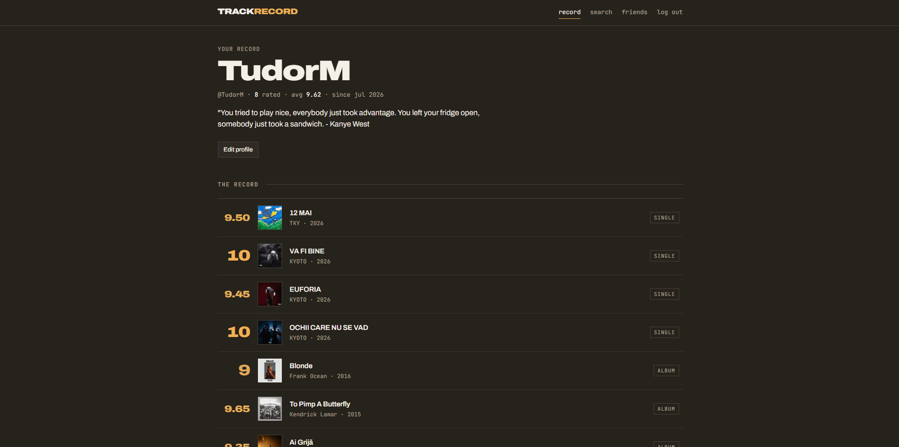
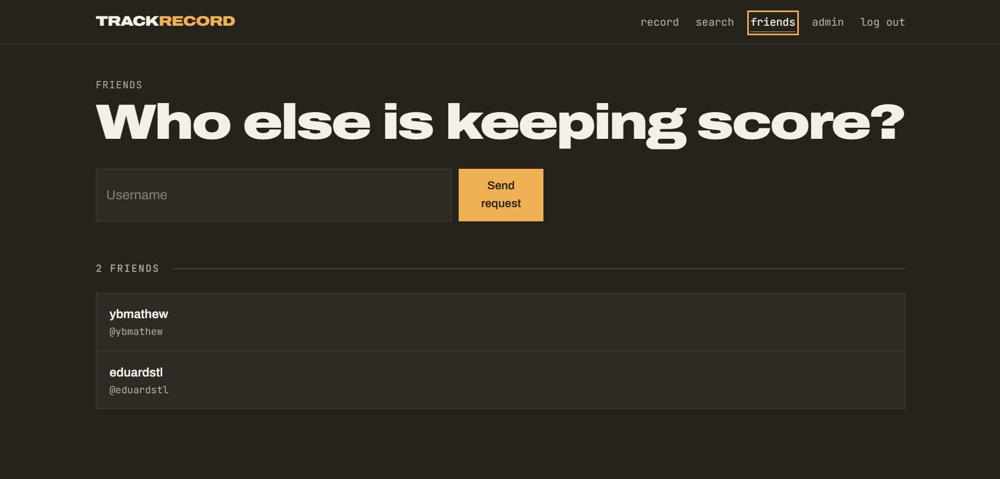

# TrackRecord

**Rate every album you hear, and keep the list behind a friendship.** Scores go from 1 to 10 with two
decimals, because 8.75 is sometimes the honest answer. Mark the tracks that earn their place. And the
ones you would cut. Only the people whose friend request you accepted can open your profile.


### ▶ [Try the live demo](https://trackrecord.azurewebsites.net)

Click **See a sample record**. It signs you in as a demo profile that already has rated albums and one
accepted friend, so you can watch the privacy rule work from both sides without filling in a single
form. The demo data rebuilds itself on every visit, so nobody inherits the state the last visitor
left behind.

---

## Screenshots

**Everything you rated, newest first**



**An album: the score dial, and a verdict on every track**


**Friend requests in both directions, and a stranger's locked profile**



---

## What this project demonstrates

### Authentication written by hand

Nothing in the login flow comes from an auth library. On my last project ASP.NET Identity did all of
this and I never saw inside it, which is exactly why I wanted it written out here.

Register hashes the password with bcrypt at a cost you set per environment. Login compares the hash,
writes a row into a `Session` table and hands back that row's id in an `HttpOnly` cookie. One
middleware turns the cookie into a user on every protected request, and an expired session gets
deleted and its cookie cleared in the same pass.

Sessions live in the database on purpose. You cannot withdraw a JWT before it expires without keeping
a blocklist somewhere, and a blocklist is a session table wearing a disguise. The cost here is one
indexed primary-key read per request, and in exchange logging out deletes the row and the credential
is dead before the next request arrives.

### Authorisation is the point of the app

`GET /api/users/:username` works out a relationship before it works out anything else: `self`,
`friends`, `pending_sent`, `pending_received` or `none`. Only the first two get the full response. A
stranger receives an id, a username, a display name and the relationship word, and that is the whole
payload.

```ts
const canSeeFullProfile = relationship === "self" || relationship === "friends";

if (!canSeeFullProfile) {
  res.json({ ...publicProfile, relationship });
  return;
}
```

The frontend reads the same `relationship` value to decide whether to offer *add friend*, *cancel
request*, *accept* or nothing at all, so the data and the buttons cannot drift apart.

### One row per friendship

A friendship is a single row: `requesterId`, `receiverId`, `status`, unique on the pair. Mirrored
rows in both directions would let "are these two friends?" come back half-answered, and every accept
would have to touch two rows inside a transaction to stay honest. One row costs an `OR` over both
directions on every lookup, and that cost is paid in one query.

A declined request gets reused. Sending again flips the same row back to `PENDING` with the new
direction, so two users can never build up a history that contradicts itself.

### A real catalogue, no API key

Search asks Deezer for albums and tracks in parallel, merges both lists, drops duplicates by external
id, then re-ranks the result with a scoring function: exact title match, prefix match, artist match,
whole-word hits, a small bump for albums over singles. Deezer's own ordering buries obvious matches.
Search an artist you know well and the reason for the re-rank shows up in the first three results.

A release reaches the local database only when somebody opens it, and its track list is fetched on
first view. So the database ends up holding the records people care about and nothing else. Deezer's
search endpoint needs no key and no account, which means there is no secret anywhere along this path.

---

## Architecture

```
server/                Express API, and in production the host for the built client
  src/
    routes/            one router per domain: auth, users, friends, releases, music, admin
    middleware/        requireAuth, requireAdmin, optionalAuth
    music.ts           Deezer client: search, release details, track lists
    demo.ts            builds and resets the demo account and its friend
    seed.ts            creates or promotes the admin account from environment variables
    types.ts           shared unions: ReleaseKind, FriendshipStatus, Verdict, Role
  prisma/              schema and migrations
client/                React 19 + Vite, plain CSS, no component library
```

**One deployable.** Express serves `/api/*` and, in production, the static bundle out of
`client/dist`, falling through to `index.html` so a refresh on a client-side route still lands
somewhere. One App Service hosts both, which is why the session cookie works with `SameSite=Lax` and
why the project carries no CORS configuration at all.

**Seven tables.** `User`, `Release`, `Rating`, `Track`, `TrackVerdict`, `Friendship`, `Session`.
`Rating` is unique on `(releaseId, userId)` and `TrackVerdict` on `(userId, trackId)`, so
double-rating something is impossible at the database level and the write path is an `upsert` against
that constraint.

---

## The API

```
POST   /api/auth/register                          create an account
POST   /api/auth/login                             start a session
POST   /api/auth/demo                              rebuild the demo data and sign in as it
POST   /api/auth/logout                            delete the session row
GET    /api/auth/me                                the signed-in user

GET    /api/users/:username                        full profile for self and friends, stub otherwise
PATCH  /api/users/me                               display name and bio

GET    /api/friends                                accepted friends
GET    /api/friends/requests                       received, still pending
GET    /api/friends/requests/sent                  sent, still pending
POST   /api/friends/requests                       send one, by username
POST   /api/friends/requests/:id/accept            accept, receiver only
POST   /api/friends/requests/:id/decline           decline, receiver only
DELETE /api/friends/:username                      unfriend

GET    /api/music/search?q=                        search the Deezer catalogue
POST   /api/releases                               import a release into the local database
GET    /api/releases/:id                           release with its average score and your own
PUT    /api/releases/:id/rating                    rate it, 1 to 10, two decimals
DELETE /api/releases/:id/rating                    withdraw your rating
GET    /api/releases/:id/tracks                    track list, imported on first view
PUT    /api/releases/:id/tracks/:trackId/verdict   mark a track GOOD or BAD
DELETE /api/releases/:id/tracks/:trackId/verdict   clear the mark

GET    /api/admin/stats                            counts across the whole instance
GET    /api/admin/users                            every account, with rating counts
PATCH  /api/admin/users/:id/role                   promote or demote
DELETE /api/admin/users/:id                        delete an account and everything it owns
GET    /api/admin/releases                         every imported release
DELETE /api/admin/releases/:id                     delete a release and its ratings
```

---

## Security decisions

- **Identity comes from the session cookie.** No endpoint reads a user id out of a request body.
  `req.user` is set by middleware, every write is scoped to it, and there is no parameter left to
  tamper with.
- **The admin area answers 404.** A 403 would confirm that `/api/admin/*` exists and that you found a
  real route. Someone without the role gets what an unmapped path would have given them.
- **Failed logins stay quiet about which half was wrong.** An unknown email and a bad password
  produce the same response, so the endpoint is useless for enumerating accounts.
- **Cookies are `HttpOnly`, `SameSite=Lax`, and `Secure` in production.** JavaScript cannot read the
  session id, so an injected script has nothing to lift.
- **Only the receiver of a friend request can accept or decline it.** The requester gets a 403 on
  their own request, and a user unrelated to the pair gets a 404.
- **Account deletion cascades inside a transaction.** Ratings, verdicts, friendships and sessions go
  in one unit, so an interrupted delete cannot leave rows pointing at a user who is gone.
- **The bcrypt cost is per environment.** The default of 10 came out of measuring: at 12, every login
  on a small shared instance had latency you could feel. Raise it where the CPU can afford it.
- **No secret in the repository.** Admin credentials come from environment variables, and seeding is
  skipped when they are unset, so no environment quietly gets a known password.

---

## Running it locally

Needs [Node 22 or newer](https://nodejs.org).

```bash
# 1. Server
cd server
npm install
printf 'DATABASE_URL="file:./dev.db"\nADMIN_EMAIL="admin@trackrecord.local"\nADMIN_PASSWORD="choose-something"\n' > .env
npx prisma migrate dev
npm run dev          # http://localhost:3000

# 2. Client, in a second terminal
cd client
npm install
npm run dev          # http://localhost:5173, proxying /api to the server
```

The admin account and the demo profile are built on first start. Open the client, click **See a
sample record**, and you land inside with data already there.

---

## Configuration

| Variable | Where | Notes |
| --- | --- | --- |
| `DATABASE_URL` | `.env`, App Service | SQLite path. On Azure it points at the persistent `/home` volume. |
| `ADMIN_EMAIL`, `ADMIN_PASSWORD` | `.env`, App Service | Creates the admin on boot, or promotes the account if it already exists. Skipped when unset. |
| `ADMIN_USERNAME` | optional | Defaults to `admin`. |
| `BCRYPT_COST` | optional | Defaults to 10. |
| `NODE_ENV` | App Service | `production` turns on `Secure` cookies and static file serving, and trusts the proxy for HTTPS detection. |
| `PORT` | App Service | Supplied by the host. Defaults to 3000. |

---

## Deployment

Azure App Service on Linux, deployed by GitHub Actions on every push to `main`, with a second workflow
type-checking both halves on every other branch and every pull request. Work happens on `development`
and reaches production through a PR.

`better-sqlite3` is a native module, so the workflow compiles it on Linux and ships the resulting
`node_modules` inside the package. A Windows build will not load there. Migrations run at startup, so
a deploy never leaves the schema and the code out of step. The SQLite file sits on `/home`, the only
directory App Service keeps across restarts.

---

## Notes and trade-offs

**SQLite, with Postgres as the upgrade path.** One writer at a time suits this workload, and Prisma
keeps the swap down to a provider line and a connection string. Neon is the next step if the instance
ever needs concurrent writes.

**Sessions in the database.** I wanted revocation to be immediate, and a table I can read to see who
is signed in. The trade is a read per request and an API that is no longer stateless. Neither costs
anything measurable on one instance. Behind a load balancer I would look again.

**Prisma driver adapters.** Prisma 7 routes SQLite through `@prisma/adapter-better-sqlite3`, so the
client is built with an explicit adapter and a bare `new PrismaClient()` throws on startup.

**No component library.** React with one stylesheet and a small set of reusable classes. The
interface is meant to read like a printed record, and a component library would have fought that the
whole way.

**The demo account resets on every visit.** A read-only demo cannot show the one thing worth showing,
which is rating an album and watching the average move, so the data gets rebuilt whenever somebody
walks in. It is shared. Two visitors in the same minute would see each other's changes, and a
per-visitor account with a cleanup job is the fix once that stops being theoretical.

---

## Roadmap

- [x] Hand-written authentication and session handling
- [x] Friend requests, and profiles visible only to accepted friends
- [x] Fractional ratings and per-track verdicts
- [x] Admin panel
- [x] Deploy with CI/CD and a public demo link
- [ ] Reviews: free text alongside a score
- [ ] An activity feed of what your friends rated recently
- [ ] Automated tests around the authorisation rules

---

Built for my portfolio. The privacy rule took the longest, because it meant deciding on paper what a
stranger is allowed to learn about you before any of it got written. The `relationship` field in
`server/src/routes/users.ts` is what came out of that.
